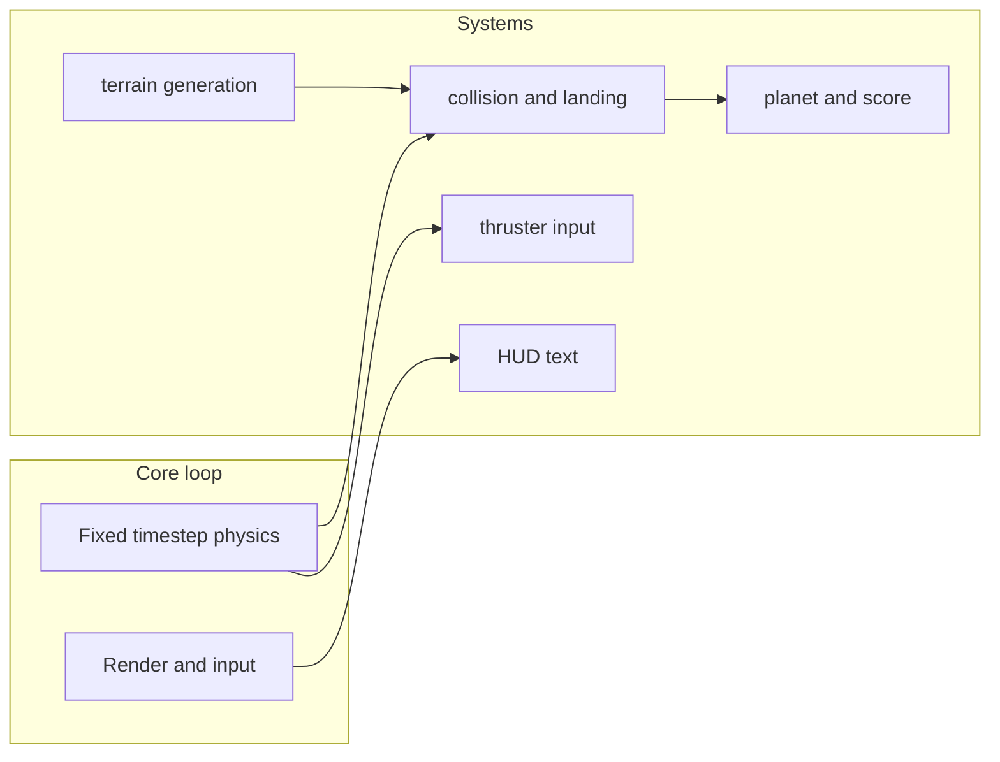

# Bevy 2D WASM landing game

## Context

This repository uses a **single binary crate** at the repo root.

## Architecture

- **State**: Bevy `States` (`AppState`: `Playing`, `GameOver`) so input and physics ignore dead states cleanly.
- **Physics**: Integrate in **`FixedUpdate`** with constant `dt`. Store **velocity** (`Vec2`) on the ship; each step apply gravity, then thruster accelerations when keys are held and fuel > 0.
- **Terrain**: Piecewise-linear height profile — ordered `(x, y)` points; profile depends on **planet** (Saturn & Uranus use smoother generation). **2–3 flat segments** are landing pads.
- **Collision**: Sample terrain height at ship feet. **Crash** if not on a pad or impact speed too high. **Safe landing** on a pad below speed thresholds → points, refill fuel, next planet (or victory after Pluto).
- **Rendering**: `Mesh2d` for terrain polygon; composite `Mesh2d` for ship.

## Thrusters and fuel

- **Center** (Arrow Down): thrust straight up — slows descent.
- **Left** (←): left side thruster (horizontal + vertical).
- **Right** (→): right side thruster (horizontal + vertical).
- **Fuel**: Single tank; drains while any thruster fires.

## Planets and gravity

Bodies in progression order (planets and moons); gravity uses representative **m/s²** values scaled into game units (see `planets.rs` / `physics`).

| Phase | Body    | Gravity (m/s²) |
| ----- | ------- | ---------------- |
| 1     | Mercury | 3.70             |
| 2     | Venus   | 8.87             |
| 3     | Earth   | 9.81             |
| 4     | Moon    | 1.62             |
| 5     | Mars    | 3.71             |
| 6     | Jupiter | 24.79            |
| 7     | Saturn  | 10.44            |
| 8     | Uranus  | 8.69             |
| 9     | Neptune | 11.15            |
| 10    | Pluto   | 0.62             |

**Terrain**: `terrain_profile_for(planet)` in `terrain.rs` — **Saturn** and **Uranus** use lower high-frequency amplitudes, less noise, and post-smoothing passes; other bodies use the jagged rocky profile with small per-planet tweaks.

## HUD

Upper-right UI: methane (fuel), horizontal and vertical velocity, current planet.

## WASM build

- Target: `wasm32-unknown-unknown`
- `getrandom` with `wasm_js` on wasm; `console_error_panic_hook` in `main`
- Bevy features: `2d`, `web`, `png` (see `Cargo.toml`)
- Serve over HTTP (e.g. `wasm-server-runner`, `trunk`, or static server). See [README.md](../README.md).

## Modules

| File          | Role                                              |
| ------------- | ------------------------------------------------- |
| `main.rs`     | App, plugins, state, wasm panic hook              |
| `camera.rs`   | Camera / world bounds                             |
| `terrain.rs`  | Generation, mesh, height queries, planet profiles |
| `ship.rs`     | Ship component, spawning                          |
| `physics.rs`  | Gravity, thrusters, integration                   |
| `collision.rs`| Landing vs crash                                  |
| `game_flow.rs`| Score, planet progression, restart                |
| `ui.rs`       | HUD                                               |
| `planets.rs`  | Planet ordering and gravity constants             |

## Game rules

- **One crash**: First crash → `GameOver` (failed run).
- **Points**: Base per landing + bonus for lower speed.
- **Victory**: Successful landing on **Pluto** ends the run in a win state.

## Deliverables

1. Native: `cargo run`
2. WASM: `cargo build --target wasm32-unknown-unknown --release` + HTTP serve
3. Playable loop: Mercury → … → Pluto; HUD; fuel; three thrusters; procedural terrain with pads; single life.
